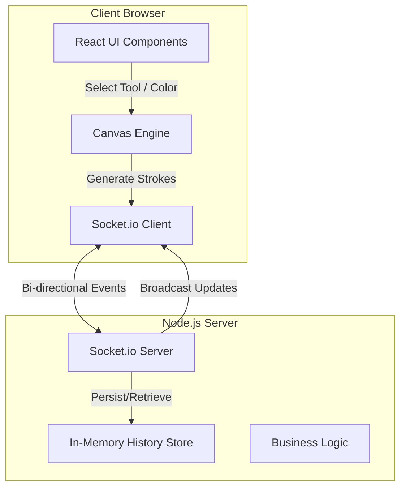
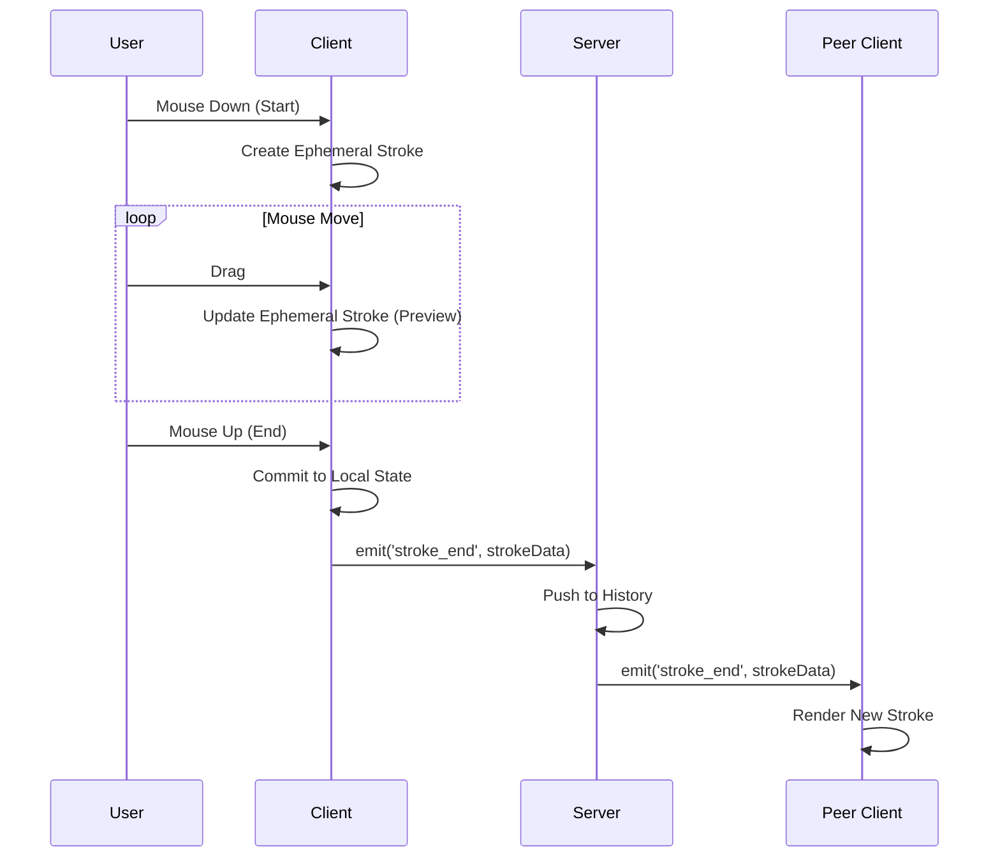
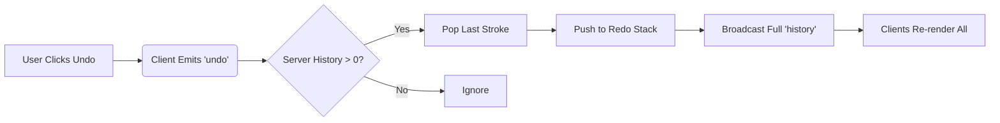
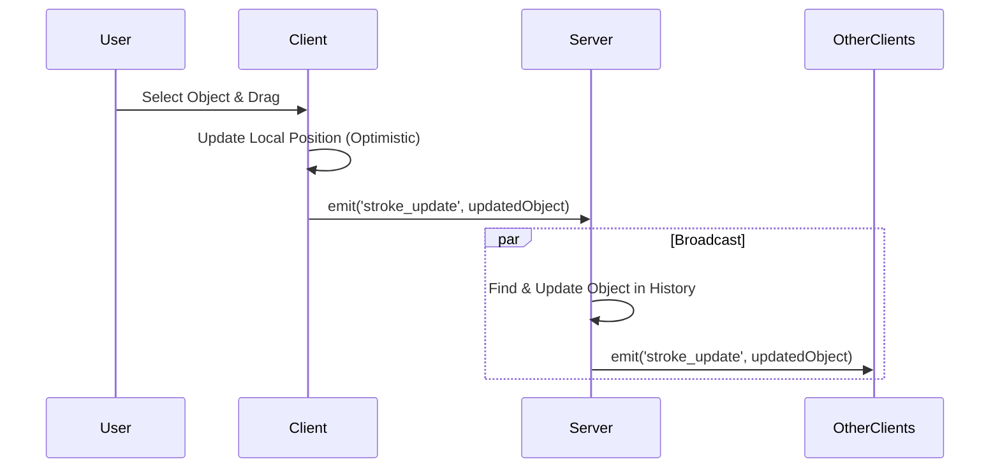
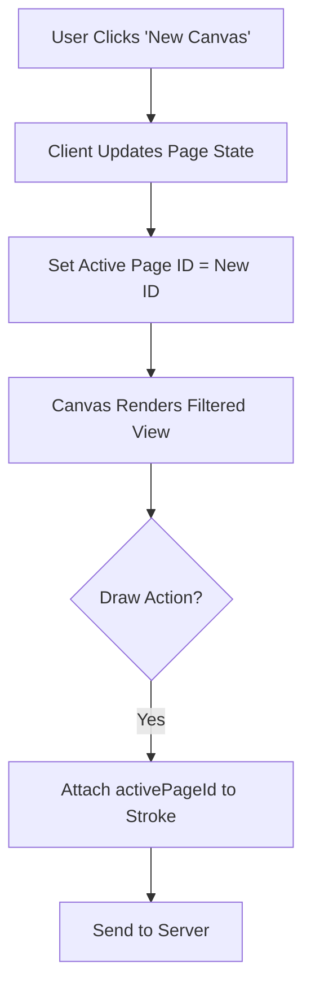

# Architecture

## 1. System Overview

**Collaborative Canvas** is a real-time drawing application built on the MERN stack (minus database for now, using in-memory storage) + WebSockets.

* **Frontend**: React, Vite, Tailwind CSS, HTML5 Canvas API.
* **Backend**: Node.js, Express, Socket.io.
* **Communication**: Real-time bidirectional event stream via Socket.io.

## 2. High-Level Architecture



## 3. Data Data Model

The core data unit is the **StrokeObject**. We do not store raw pixels; we store vector-like instructions.

### `StrokeObject` Structure

```javascript
{
  id: "unique_id_string",
  pageId: 1,              // Which canvas page this belongs to
  tool: "brush" | "rectangle" | "circle" | "text" | ...,
  points: [{x, y}, ...],  // For freehand brush
  start: {x, y},          // For shapes
  end: {x, y},            // For shapes
  color: "#ff0000",
  fillColor: "transparent",
  width: 5,
  text: "Hello"           // Only for text tool
}
```

### Server Store

```javascript
let history = [ StrokeObject, StrokeObject, ... ];
let redoStack = [ StrokeObject, ... ];
```

## 4. Key Workflows

### 4.1. Drawing Flow

The user draws a shape. The client shows it immediately (optimistic UI), then commits it to the server.



### 4.2. Stroke-Based Undo/Redo

We use a complete stroke replacement strategy for robust undo.



### 4.3. Object Manipulation (Move/Fill)

Modifying an existing object (Moving or Filling) updates its properties or replaces it.



### 4.4. Multi-Canvas (Pages)



## 5. Event Reference

| Event Name | Direction | Payload | Description |
| :--- | :--- | :--- | :--- |
| `connection` | S -> C | `socket.id` | Initial handshake. |
| `history` | S -> C | `Array<StrokeObject>` | Sent on connect or massive change (Undo/Redo). |
| `stroke_end` | C <-> S | `StrokeObject` | Sent when a shape/stroke is finished or created. |
| `stroke_update` | C <-> S | `StrokeObject` | Sent when an object is modified (Moved). |
| `undo` | C -> S | `null` | Request to undo last action. |
| `redo` | C -> S | `null` | Request to redo. |
| `clear` | C -> S | `null` | Request to wipe canvas. |
